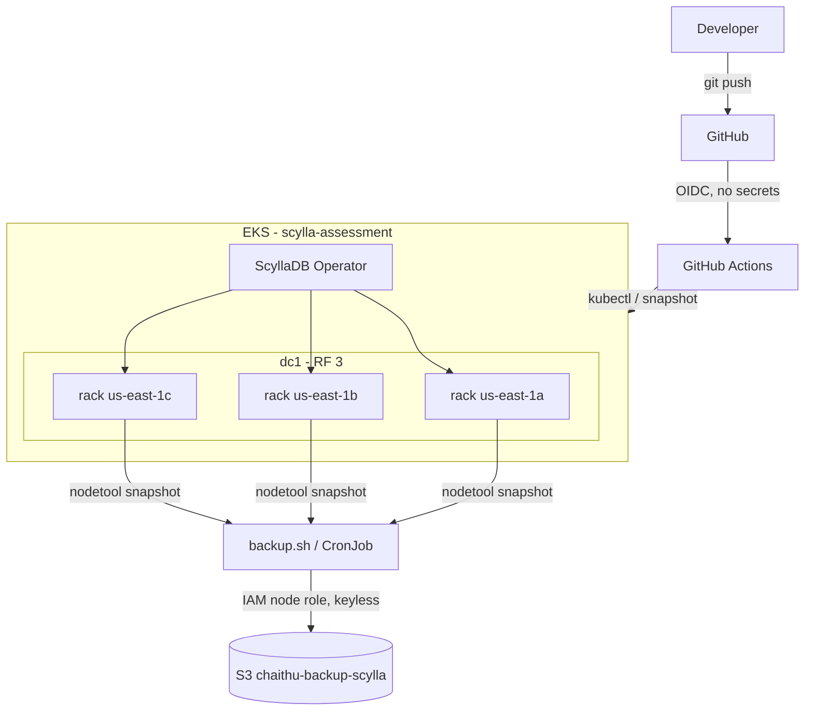

# ScyllaDB on EKS

My submission for the "spin up a database on Kubernetes" task. I went with ScyllaDB because it has the most moving parts of the options given, so it gave me more room to show the Kubernetes, storage and AWS side of things.

Short version of what's here: a 3 node ScyllaDB cluster on EKS, one node per Availability Zone, deployed with the ScyllaDB Operator and provisioned end to end with Terraform. Backups go to S3 through a GitHub Actions pipeline. There are no long lived AWS keys anywhere, CI uses OIDC and the pods use IAM roles.

## Architecture



One datacenter, three racks, one rack per AZ, replication factor 3. Each of the three copies of a row lands in a different AZ, so the cluster keeps serving even if a whole AZ drops. The Operator runs the StatefulSets, PVCs, services, PodDisruptionBudgets and TLS certs, so I'm not hand writing any of that.

## What's in the repo

```
DB-demo/
├── README.md
├── eks/terraform-eks/            # all the AWS infra
│   ├── vpc.tf eks.tf iam.tf ...
│   ├── backend.tf                # S3 remote state
│   ├── github-oidc.tf            # keyless CI role
│   └── bootstrap/                # makes the state bucket
├── k8s/
│   ├── storageclass.yaml namespace.yaml scylla-config.yaml
│   ├── scylla-cluster.yaml       # 3 racks, one per AZ
│   ├── backup-cronjob.yaml
│   └── gha-rbac.yaml
├── scripts/
│   ├── backup.sh                 # the backup tool
│   └── health-check.sh
└── .github/workflows/
    └── backup.yml                # keyless backup pipeline
```

## Running it

You need Terraform 1.11+, kubectl, helm and the aws CLI, plus an account that can create EKS, EC2, IAM and S3.

### 1. Infra

```bash
cd eks/terraform-eks/bootstrap
terraform init && terraform apply -var state_bucket_name=chaithu-scylla-tfstate
cd ..
cp backend.hcl.example backend.hcl
terraform init -backend-config=backend.hcl
terraform apply
aws eks update-kubeconfig --name scylla-assessment --region us-east-1
```

That builds the VPC across 3 AZs, the EKS cluster, two node groups (one tainted for Scylla and one for everything else), the IRSA roles for the EBS CSI driver and Cluster Autoscaler, a bucket scoped S3 policy on the Scylla node role and the GitHub OIDC role for CI.

### 2. Operator and cluster

```bash
kubectl apply -f k8s/storageclass.yaml
helm repo add jetstack https://charts.jetstack.io
helm repo add scylla-operator https://storage.googleapis.com/scylla-operator-charts/stable
helm repo update
helm upgrade --install cert-manager jetstack/cert-manager -n cert-manager --create-namespace --set crds.enabled=true
helm install scylla-operator scylla-operator/scylla-operator -n scylla-operator --create-namespace --wait

kubectl apply -f k8s/namespace.yaml -f k8s/scylla-config.yaml -f k8s/scylla-cluster.yaml
kubectl -n scylla get pods -w
```

### 3. Check it

```bash
POD=$(kubectl -n scylla get pods -l scylla/cluster=scylladb -o jsonpath='{.items[0].metadata.name}')
kubectl -n scylla exec -it "$POD" -c scylla -- nodetool status
```

You want three UN lines and the Rack column showing your three AZs.

## The four aspects

**Usability.** Access is plain CQL over cqlsh. There's an app role with only the grants it needs instead of using the cassandra superuser, plus a health-check script that returns PASS when the expected node count is up.

**Resilience.** Delete a Scylla pod and the cluster keeps answering reads from the other two at QUORUM. The Operator recreates the pod and it comes back with its data, because the data sits on the PVC, not the pod. Racks map to AZs so losing a full AZ still leaves 2 of 3 replicas.

**Scalability.** Change `members` in one file and apply. The Operator adds members and Cluster Autoscaler adds nodes. No StatefulSet editing. It scales 3 to 6 (multiples of 3, since there are 3 racks).

**Security.** PasswordAuthenticator and CassandraAuthorizer are on, the Operator wires TLS through cert-manager and there are no static AWS keys anywhere. CI assumes a role through GitHub OIDC and the pods reach S3 through the node's IAM role.

## Backup to S3

ScyllaDB's own backup is `nodetool snapshot`. Since the data is RF 3 across 3 nodes, one node's snapshot is a full copy. The tool snapshots the keyspace, pulls the SSTable files out and pushes them to S3.

```bash
NS=scylla KEYSPACE=demo BUCKET=chaithu-backup-scylla POD=scylladb-dc1-us-east-1a-0 bash scripts/backup.sh
aws s3 ls s3://chaithu-backup-scylla/demo/
```

Same logic runs three ways: the script above, a CronJob inside the cluster (`k8s/backup-cronjob.yaml`) and a GitHub Action (`.github/workflows/backup.yml`) that authenticates with OIDC, so no keys live in the repo.

I did start with ScyllaDB Manager, which is the proper tool for this. Its Helm chart assumes Scylla's reference setup though, local NVMe storage class, specific node labels and taints. It fought this EBS based cluster at every step. The task asked for a simple backup tool, so I built one on the actual primitive instead. Lighter and easier to explain.

## A few decisions worth calling out

Rack per AZ instead of a single rack. ScyllaDB replicates by rack, so making each rack an AZ means the replica count matches the failure domains and RF 3 survives an AZ outage. The trade is scaling in steps of 3. A single rack would scale 3 to 5 but only protect against a single node dying. I'd rather have the AZ story since resilience is being scored.

gp3 instead of local NVMe. Scylla's reference uses local NVMe for speed, but those disks are fixed size and disappear with the node. The task mentioned resizing volumes as the DB grows. gp3 with allowVolumeExpansion does that online. I gave up some IOPS for that.

Keyless everywhere. This was a deliberate call because security is scored. Nothing in the repo or the cluster holds an AWS key.

## Things that broke

Being honest, most of my time went here and not on the happy path.

→ ScyllaCluster create hung on the operator webhook. The EKS node security group was blocking the control plane from reaching the webhook pod on port 5000. Added an ingress rule for it.

→ GitHub Actions couldn't assume the role, kept getting "not authorized". My account puts immutable IDs in the OIDC subject (`owner@id/repo@id`), so a name based trust policy never matched. Scoped the trust to the IDs instead, which is more solid anyway since IDs don't change on a rename.

→ S3 access denied from CI. The IAM policy was still scoped to the old bucket name after I renamed the bucket.

→ `tar: command not found` during backup. The Scylla image has no tar, so I list the snapshot files with find, stream them out with cat and pack them on the client side.

→ PVCs wouldn't bind. The manager chart defaulted to a local-xfs storage class that doesn't exist here. The old in-tree gp2 provisioner is also gone on 1.33. Pointed everything at a gp3 StorageClass on the EBS CSI driver.

## Cleanup

```bash
cd eks/terraform-eks && terraform destroy
```
